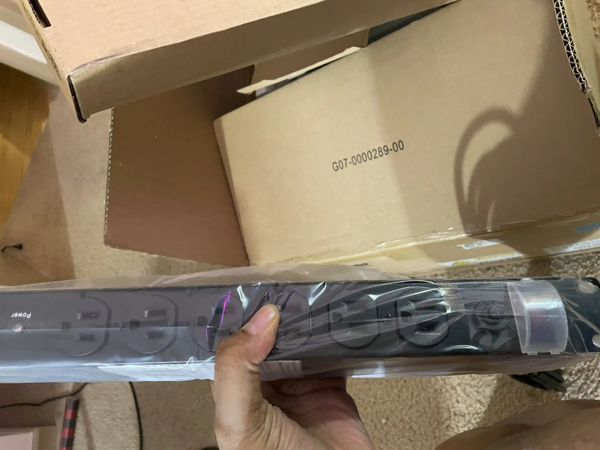
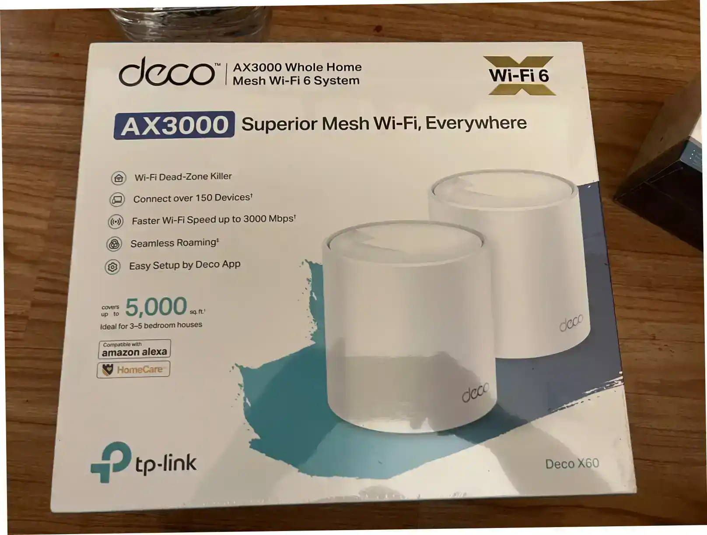
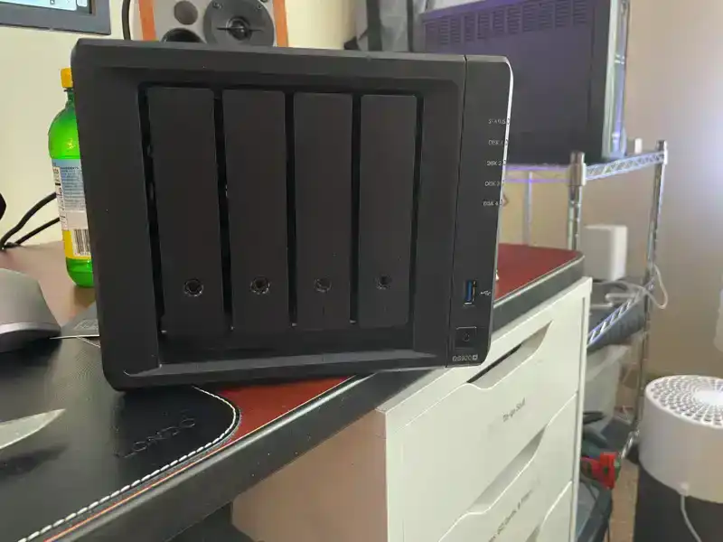

# Hardware

## Home Server

!!!info "Info"
    You can get most of the main hardware cheaply; my NUC cost 
    under $500. The performance benefit is worth the price alone.

=== "Home Server Hardware"
     Here is a photo of the main device running Home Assistant proper, an Intel NUC. 
      
       
    {: loading=lazy } 
     
     

    {: loading=lazy } 
     
     

    {: loading=lazy } 
     
     

    {: loading=lazy } 

=== "Switches"
    Using TP-Link switches and UniFi Dream Machine Pro to manage my home network. I need an AP just haven't bought one yet. Then I can manage the wifi in the UniFi Network App. 
     
     
    {: loading=lazy } 
     
     
    
    {: loading=lazy } 
     
     
    --- 

    {: loading=lazy } 
     
     

    {: loading=lazy } 
     
     

=== "Power"

    {: loading=lazy } 
     
     

    {: loading=lazy } 
     
     

    {: loading=lazy } 

## Networking

!!!note "Note"
    This home networking stuff is still in progress.

So far I've got mesh wifi 6 networking setup around the house.

=== "WiFi"

    {: loading=lazy } 
     
     

    {: loading=lazy } 
     
     

    {: loading=lazy } 
     
     

## Storage and Containers

!!!note "Note"
    I'm using a Synology 920+.

    I've archived some images and videos on it but I've also got Docker containers as well as VMM running Home Assistant.

=== "Synology"

    {: loading=lazy } 
     
     

    {: loading=lazy } 
     
     

    {: loading=lazy } 
     
     

### Raspberry Pi 4

I've since moved onto a NUC but I am thinking of using this as an IR relay or something.

### Devices

Below you will find a list of my devices connected to the local network. Most of them, except for Apple TV, have static IP addresses.

!!!warning "Under construction"
    These tables are still in progress!

| Device                                        | HA Integration                | Has Add-on |
| --------------------------------------------- | ----------------------------- | ---------- |
| [Apple TV 4K](apple-tv)                       | [Apple TV](ha-apple-tv)       | No         |
| [Kasa Smart Smart Plugs](kasa-smart-plugs)    | [TP-Link Kasa](kasa-smart)    | No         |
| [LG 55" OLED TV](tv)                          | [LG webOS](ha-lg-webos)       | No         |
| [Philips Hue Ambient](philips-hue-ambient)    | [Philips Hue](ha-philips-hue) | No         |
| [Philips Recessed Bulb](philips-hue-recessed) | [Philips Hue](ha-philips-hue) | No         |
| [Philips Hue White Bulbs](philips-hue-white)  | [Philips Hue](ha-philips-hue) | No         |

[apple-tv]: https://www.apple.com/apple-tv-4k/
[kasa-smart-plugs]: https://www.amazon.com/gp/product/B08LN3C7WK/ref=ppx_yo_dt_b_search_asin_title?ie=UTF8
[tv]: https://www.lg.com/us/tvs/lg-oled55c1pub-oled-4k-tvq67r-55-inch-qled-4k-smart-tv-qe55q67rauxua/
[pi]: https://www.raspberrypi.org/products/raspberry-pi-4-model-b/
[philips-hue-ambient]: https://www.yeelight.com/en_US/product/lemon2-color
[philips-hue-recessed]: https://www.amazon.com/gp/product/B07QV9X5W6/ref=ppx_yo_dt_b_search_asin_title?ie=UTF8&psc=1
[philips-hue-white]: hhttps://www.amazon.com/gp/product/B07QWB3J8W/ref=ppx_yo_dt_b_search_asin_title?ie=UTF8&psc=1
[philips-hue-motion]: https://www.amazon.com/gp/product/B01KJYSOGI/ref=ppx_yo_dt_b_search_asin_title?ie=UTF8&psc=1
[ps5]: https://www.playstation.com/en-us/ps5/?smcid=other:en-us:blank:primary%20nav:msg-hardware:ps5
[xbox]: https://www.xbox.com/en-US/consoles/xbox-series-x?xr=shellnav#purchase
[roborock-s5]: https://www.amazon.com/gp/product/B07YC74CYL/ref=ppx_yo_dt_b_search_asin_title?ie=UTF8&psc=1
[roborock-s6-pure]: https://www.amazon.com/gp/product/B08BC1RJRV/ref=ppx_yo_dt_b_search_asin_title?ie=UTF8&psc=1
[humidifier]: https://www.amazon.com/gp/product/B08HS45N13/ref=ppx_yo_dt_b_search_asin_title?ie=UTF8&psc=1
[air-purifier-h]: https://www.amazon.com/gp/product/B08TMVCKCG/ref=ppx_yo_dt_b_search_asin_title?ie=UTF8&psc=1
[air-purifier-c]: https://www.amazon.com/gp/product/B094DY2616/ref=ppx_yo_dt_b_search_asin_title?ie=UTF8
[google-nest-hub-max]: https://store.google.com/product/google_nest_hub_max?hl=en-US
[google-nest-hub]: https://store.google.com/product/nest_hub_2nd_gen?hl=en-US
[google-nest-mini]: https://store.google.com/us/product/google_nest_mini
[echo]: https://www.amazon.com/gp/product/B085HK4KL6/ref=ppx_yo_dt_b_search_asin_title?ie=UTF8

[homekit]: https://www.home-assistant.io/integrations/homekit_controller/
[ha-philips-hue]: https://www.home-assistant.io/integrations/hue/
[ps5-mqtt]: https://github.com/FunkeyFlo/ps5-mqtt
[cast]: https://www.home-assistant.io/integrations/cast/
[xiaomi-miio]: https://www.home-assistant.io/integrations/xiaomi_miio/
[xiaomi_airpurifier]: https://github.com/syssi/xiaomi_airpurifier
[ha-apple-tv]: https://www.home-assistant.io/integrations/apple_tv/
[ha-lg-webos]: https://www.home-assistant.io/integrations/webostv/
[kasa-smart]: https://www.home-assistant.io/integrations/tplink/
[esphome]: https://www.home-assistant.io/integrations/esphome/

## Zigbee Network

My Zigbee devices are connected to Home Assistant via [ConBee II](https://www.amazon.com/gp/product/B07PZ7ZHG5/ref=ppx_yo_dt_b_search_asin_title?ie=UTF8) as suggested by the community and on Reddit. Devices are controlled by Home Assistant via: [zigbee2mqtt](https://www.zigbee2mqtt.io/) + [Mosquitto](https://mosquitto.org/) + [MQTT Integration](https://www.home-assistant.io/integrations/mqtt/).

## ZWave

I am using the [Aeotec Z-Stick Gen5 Z-Wave Hub](https://www.amazon.com/gp/product/B00X0AWA6E/ref=ppx_yo_dt_b_search_asin_title?ie=UTF8) to allow me to connect some of my ZWave devices, like my Ring Alarm Keypad Gen 2, to Home Assistant with the [Z Wave JS](https://www.home-assistant.io/integrations/zwave_js/) integration.

<!-- ### Devices

| Device                                                         | Quantity | Notes                                            |
| :------------------------------------------------------------- | :------: | :----------------------------------------------- |
| [Aqara Smart LED Bulb 9W][aqara-bulb]                          |    5     | Ceiling and Main lights                          |
| [Aqara Motion Sensor][aqara-motion]                            |    2     | Detecting motions in both rooms                  |
| [Aqara Magic Cube Controller][aqara-cube]                      |    1     | Controlling lights, scenes and modes             |
| [Aqara Conditions Sensor][aqara-conditions]                    |    1     | Internal temperature, humidity and pressure data |
| [Aqara Contact Sensor][aqara-contact]                          |    1     | Detection front door opening                     |
| [Aqara Single Switch Module T1 (without neutral)][aqara-relay] |    1     | Switching corridor light                         |
| [MiJia Conditions Sensor][mija-conditions]                     |    1     | Internal temperature and humidity data           |
| [Tuya Smart ZigBee Radiator][tuya-trv]                         |    2     | Adjusting heaters temperature                    |
| [Lonsonho 2-Gang Switch 2 (without neutral)][lonsonho-switch]  |    1     | Switching kitchen lights    -->

