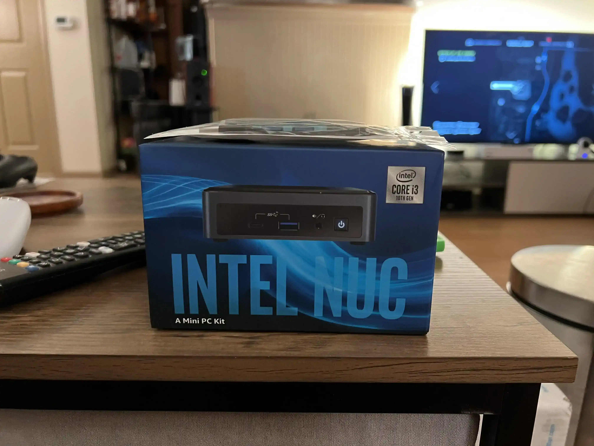
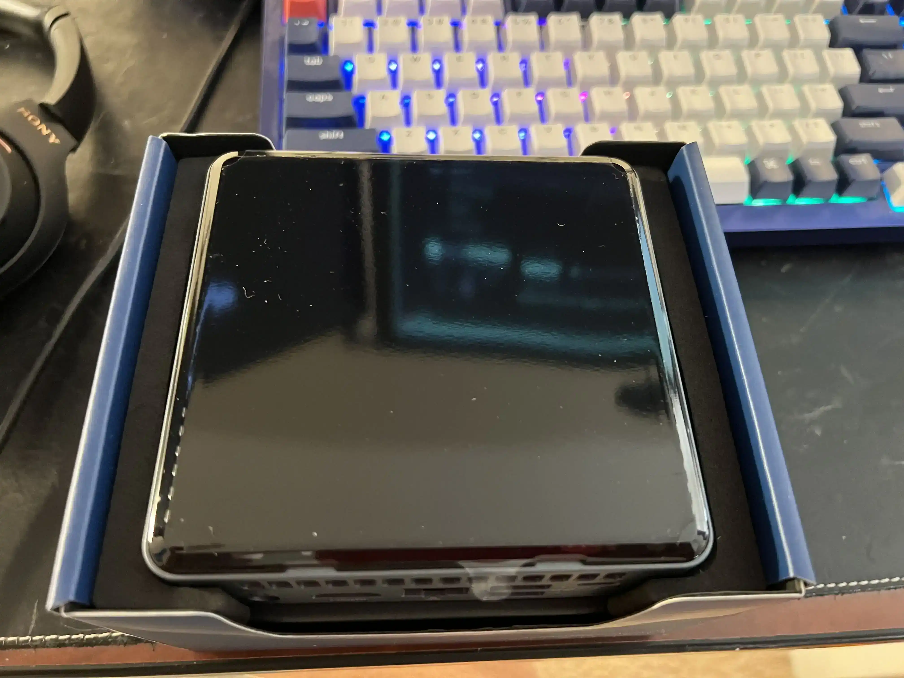
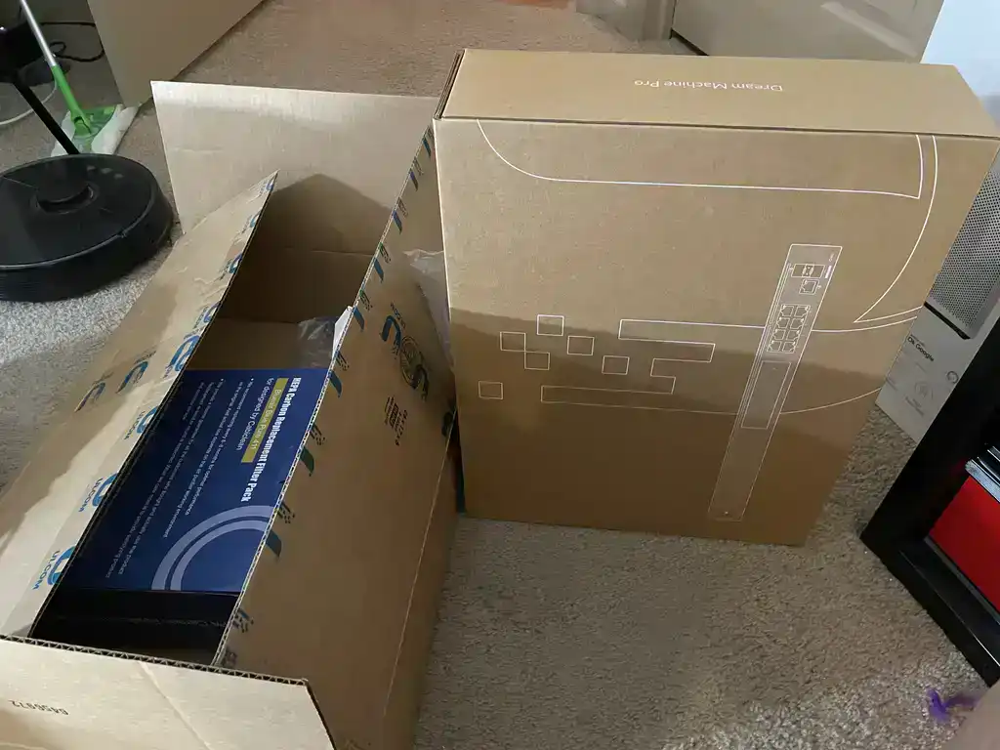
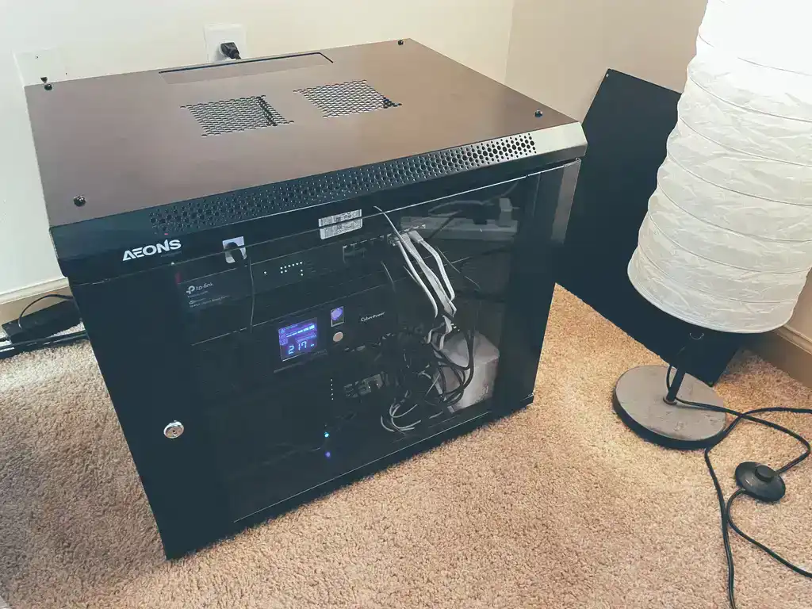

# Hardware

## Home Server

!!!info "Info"
    You can get most of the main hardware cheaply; my NUC cost 
    under $500. The performance benefit is worth the price alone.

=== "Home Server Hardware"
     Here is a photo of the main device running Home Assistant proper, an Intel NUC. 
      
       
    {: loading=lazy } 
     
     

    {: loading=lazy } 
     
     

    {: loading=lazy } 
     
     

    {: loading=lazy } 

=== "Switches"
    Using TP-Link switches and UniFi Dream Machine Pro to manage my home network. I need an AP just haven't bought one yet. Then I can manage the wifi in the UniFi Network App. 
     
     
    {: loading=lazy } 
     
     
    
    {: loading=lazy } 
     
     
    --- 

    {: loading=lazy } 
     
     

    {: loading=lazy } 
     
     

=== "Power"

    {: loading=lazy } 
     
     

    {: loading=lazy } 
     
     

    {: loading=lazy } 

## Networking

!!!info "Info"
    This home networking stuff is still in progress.

So far I've got mesh wifi 6 networking setup around the house.

=== "WiFi"

    {: loading=lazy } 
     
     

    {: loading=lazy } 
     
     

    {: loading=lazy } 
     
     

## Storage and Containers

!!!info "Info"
    I'm using a Synology 920+.

    I've archived some images and videos on it but I've also got Docker containers as well as VMM running Home Assistant.

=== "Synology"

    {: loading=lazy } 
     
     

    {: loading=lazy } 
     
     

    {: loading=lazy } 
     
     

### Raspberry Pi 4

I've since moved onto a NUC but I am thinking of using this as an IR relay or something.

<!-- ### Devices

Below you will find a list of my devices connected to the local network. Most of them, except for Apple TV, have static IP addresses.

| Device                                       | IP                 | HA Integration                |
| -------------------------------------------- | :----------------- | ----------------------------- |
| [Apple TV 4K][apple-tv]                      | `192.168.50.x`\*   | [Apple TV][ha-apple-tv]       |
| [Koogeek P1EU Smart Plug][koogeek-p1]        | `192.168.50.9`     | [HomeKit Controller][homekit] |
| [Koogeek P1EU Smart Plug][koogeek-p1]        | `192.168.50.10`    | [HomeKit Controller][homekit] |
| [Koogeek P1EU Smart Plug][koogeek-p1]        | `192.168.50.11`    | [HomeKit Controller][homekit] |
| [Samsung 55" Q67R 4K Smart QLED TV][tv]      | `192.168.50.93`    | [ha-samsungtv-tizen]\*\*      |
| [Raspberry Pi][pi]                           | `192.168.50.113`\* | –                             |
| [Yeelight LED Bulb 1S (Color)][yeelight-1s]  | `192.168.50.128`   | [Yeelight][yeelight]          |
| [Yeelight LED Bulb 1S (Color)][yeelight-1s]  | `192.168.50.129`   | [Yeelight][yeelight]          |
| [Xiaomi Bulb White and Color][yeelight-bulb] | `192.168.50.130`   | [Yeelight][yeelight]          |
| [Xiaomi Desk Lamp Pro][desk-lamp]            | `192.168.50.131`   | [Yeelight][yeelight]          |
| [PlayStation 4 Pro][ps4]                     | `192.168.50.185`\* | [Sony PlayStation 4][ha-ps4]  |
| [Roborock S5 Max][roborock]                  | `192.168.50.186`   | [Xiaomi Miio][xiaomi-miio]    |
| [Deerma Humidifier (mjjsq)][humidifier]      | `192.168.50.187`   | [xiaomi_airpurifier]\*\*      |
| [Xiaomi Air Purifier 3H][air-purifier]       | `192.168.50.188`   | [Xiaomi Miio][xiaomi-miio]    |
| [Google Home Mini][google-home-mini]         | `192.168.50.220`   | [Google Cast][cast]           |
| [Google Nest Mini][google-nest-mini]         | `192.168.50.221`   | [Google Cast][cast]           |
| [living-room-ac](#esp-devices)               | `192.168.50.x`     | [ESPHome][esphome]            |
| [bedroom-ac](#esp-devices)                   | `192.168.50.x`     | [ESPHome][esphome]            |

\* — means the device is connected via Ethernet instead of WiFi to ensure a more reliable connection.

\*\* — means the device is integrated via custom integration.

### ESP Devices

I use two ESP8266 devices based on [iot-uni-dongle](https://github.com/dudanov/iot-uni-dongle) for controlling my Midea ACs.

[apple-tv]: https://www.apple.com/apple-tv-4k/
[koogeek-p1]: https://www.koogeek.com/p-p1eu.html
[tv]: https://www.samsung.com/ua/tvs/qled-tv/q67r-55-inch-qled-4k-smart-tv-qe55q67rauxua/
[pi]: https://www.raspberrypi.org/products/raspberry-pi-4-model-b/
[yeelight-1s]: https://www.yeelight.com/en_US/product/lemon2-color
[yeelight-bulb]: https://www.aliexpress.com/item/1005001870039407.html
[desk-lamp]: https://www.aliexpress.com/item/33045143366.html
[ps4]: https://www.playstation.com/en-us/ps4/ps4-pro/
[roborock]: https://us.roborock.com/pages/roborock-s5-max
[humidifier]: https://www.aliexpress.com/item/4000056420604.html
[air-purifier]: https://www.mi.com/global/mi-air-purifier-3H
[google-home-mini]: https://store.google.com/us/product/google_home_mini_first_gen
[google-nest-mini]: https://store.google.com/us/product/google_nest_mini

[homekit]: https://www.home-assistant.io/integrations/homekit_controller/
[yeelight]: https://www.home-assistant.io/integrations/yeelight/
[ha-ps4]: https://www.home-assistant.io/integrations/ps4/
[cast]: https://www.home-assistant.io/integrations/cast/
[xiaomi-miio]: https://www.home-assistant.io/integrations/xiaomi_miio/
[xiaomi_airpurifier]: https://github.com/syssi/xiaomi_airpurifier
[ha-apple-tv]: https://www.home-assistant.io/integrations/apple_tv/
[ha-samsungtv-tizen]: https://github.com/jaruba/ha-samsungtv-tizen
[esphome]: https://www.home-assistant.io/integrations/esphome/

## Zigbee Network

My Zigbee devices are connected to Home Assistant via [SMARTLIGHT CC2652P Zigbee USB Adapter SLZB-02](https://smartlight.me/smart-home-devices/zigbee-devices/zigbee-coordinator-v4-cc2652p) as a coordinator. Devices are controlled by Home Assistant via: [zigbee2mqtt](https://www.zigbee2mqtt.io/) + [Mosquitto](https://mosquitto.org/) + [MQTT Integration](https://www.home-assistant.io/integrations/mqtt/).

!!! note
    Previosly my Zigbee network was working with [CC2531 Sniffer Board](https://www.aliexpress.com/item/4000059514865.html) as a coordinator.
    It was fine with small amount of devices, but as my network grew I started to [get weird behavior](https://github.com/home-assistant/core/issues/52301).
    Additioanlly, I've discovered that [CC2531 is no longer recommended by zigbee2mqtt developers](https://www.zigbee2mqtt.io/guide/adapters/#not-recommended).

    I connected my coordinator to the Raspberry Pi through a USB extension cable to avoid interference and improve the connection.
    This approach is suggested by [zigbee2mqtt documentation](https://www.zigbee2mqtt.io/information/FAQ.html#interview-fails).

I used to use Aqara Hub, but it switched to the current approach because of its compatibility. The current approach allows binding together [nearly every possible Zigbee device](https://www.zigbee2mqtt.io/information/supported_devices.html).

### Devices

| Device                                                         | Quantity | Notes                                            |
| :------------------------------------------------------------- | :------: | :----------------------------------------------- |
| [Aqara Smart LED Bulb 9W][aqara-bulb]                          |    5     | Ceiling and Main lights                          |
| [Aqara Motion Sensor][aqara-motion]                            |    2     | Detecting motions in both rooms                  |
| [Aqara Magic Cube Controller][aqara-cube]                      |    1     | Controlling lights, scenes and modes             |
| [Aqara Conditions Sensor][aqara-conditions]                    |    1     | Internal temperature, humidity and pressure data |
| [Aqara Contact Sensor][aqara-contact]                          |    1     | Detection front door opening                     |
| [Aqara Single Switch Module T1 (without neutral)][aqara-relay] |    1     | Switching corridor light                         |
| [MiJia Conditions Sensor][mija-conditions]                     |    1     | Internal temperature and humidity data           |
| [Tuya Smart ZigBee Radiator][tuya-trv]                         |    2     | Adjusting heaters temperature                    |
| [Lonsonho 2-Gang Switch 2 (without neutral)][lonsonho-switch]  |    1     | Switching kitchen lights   

 -->
